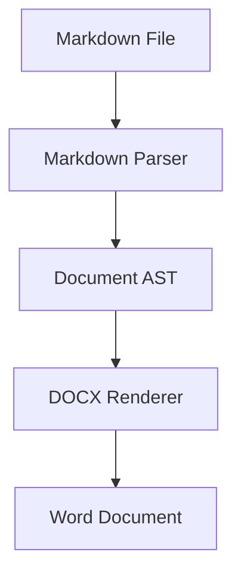
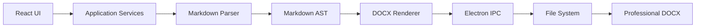
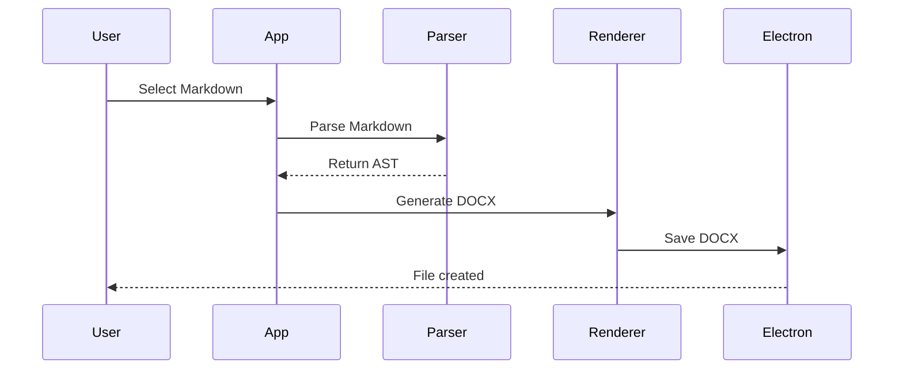
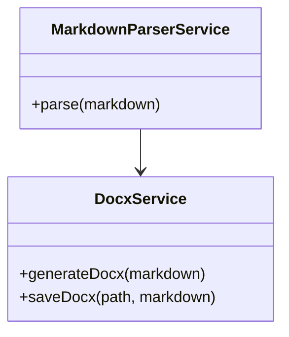

# DocForge AI — Markdown Conversion Test Suite

> Master test file for validating Markdown → Microsoft Word conversion.

\---

## Table of Contents

* [Introduction](#introduction)
* [Text Formatting](#text-formatting)
* [Links](#links)
* [Lists](#lists)
* [Task Lists](#task-lists)
* [Blockquotes](#blockquotes)
* [Code](#code)
* [Tables](#tables)
* [Images](#images)
* [Mermaid Diagrams](#mermaid-diagrams)
* [Special Characters](#special-characters)
* [Advanced Markdown](#advanced-markdown)
* [Conversion Requirements](#conversion-requirements)
* [Final Test](#final-test)

\---

## Introduction

DocForge AI converts Markdown documents into professional Microsoft Word documents.

This document intentionally contains many Markdown scenarios so every stage of the conversion engine can be tested.

### Project Goals

1. Convert Markdown into a professional Word document.
2. Preserve document structure.
3. Generate a table of contents.
4. Preserve internal links.
5. Preserve external links.
6. Render Mermaid diagrams.
7. Preserve code blocks.
8. Preserve images.
9. Preserve tables.
10. Maintain readable Word formatting.

\---

# Text Formatting

## Paragraphs

This is a normal paragraph.

This is another paragraph containing multiple sentences. Paragraph boundaries and readable spacing should be preserved.

## Bold

This is **bold text**.

This is **important information** that should appear bold in Word.

## Italic

This is *italic text*.

This is *another example of italic text*.

## Bold and Italic

This is ***bold and italic text***.

This is ***another bold and italic example***.

## Strikethrough

This is ~~deleted text~~.

This text should remain normal while ~~this portion should be struck through~~.

## Mixed Formatting

This paragraph contains **bold**, *italic*, ***bold italic***, ~~strikethrough~~, and `inline code`.

\---

# Links

## External Links

Visit [Microsoft](https://www.microsoft.com/).

Visit [GitHub](https://github.com/).

Visit [React](https://react.dev/).

Visit [Electron](https://www.electronjs.org/).

## Link with Title

[OpenAI](https://openai.com/)

## Automatic URL

https://www.example.com

## Email

Contact: example@example.com

## Internal Links

Go to the [Introduction](#introduction).

Go to the [Code section](#code).

Go to the [Final Test](#final-test).

\---

# Lists

## Unordered List

* Apple
* Orange
* Banana
* Mango

## Ordered List

1. First item
2. Second item
3. Third item
4. Fourth item

## Nested Unordered List

* Frontend

  * React
  * TypeScript
  * Vite
  * CSS
* Backend

  * Node.js
  * Express
  * TypeScript
* Desktop

  * Electron
  * Electron Vite

## Nested Ordered List

1. Development

   1. Install dependencies
   2. Write code
   3. Run tests
   4. Build application
2. Testing

   1. Functional testing
   2. Accessibility testing
   3. Performance testing
3. Release

   1. Package application
   2. Create installer
   3. Publish release

## Mixed Nested Lists

* Development

  1. Frontend
  2. Backend
  3. Desktop
* Testing

  * Unit testing
  * Integration testing
  * End-to-end testing
* Release

  1. Build
  2. Package
  3. Deploy

\---

# Task Lists

## Development Tasks

* \[x] Create Electron application
* \[x] Add Markdown file picker
* \[x] Read Markdown files
* \[x] Render Markdown preview
* \[x] Add DOCX generation
* \[x] Add output file selection
* \[ ] Improve DOCX formatting
* \[ ] Add table support
* \[ ] Add image support
* \[ ] Add Mermaid rendering
* \[ ] Add automatic TOC generation

## Release Checklist

* \[ ] Run lint
* \[ ] Run tests
* \[ ] Build application
* \[ ] Create installer
* \[ ] Test installer
* \[ ] Create GitHub release

\---

# Blockquotes

> This is a simple blockquote.

> This is a longer blockquote containing multiple lines.
>
> Markdown blockquotes should be converted into an appropriate Word paragraph style.

## Nested Blockquote

> Main quote
>
> > Nested quote
>
> Back to the main quote.

\---

# Code

## Inline Code

Use `npm install` to install dependencies.

The application uses `npm run dev` during development.

The `DocxService` is responsible for generating Word documents.

## JavaScript

```javascript
function greet(name) {
  return `Hello, ${name}!`;
}

console.log(greet("DocForge AI"));
```

## TypeScript

```typescript
interface DocumentOptions {
  generateToc: boolean;
  preserveLinks: boolean;
  renderMermaid: boolean;
  preserveCodeBlocks: boolean;
  preserveImages: boolean;
}

const options: DocumentOptions = {
  generateToc: true,
  preserveLinks: true,
  renderMermaid: true,
  preserveCodeBlocks: true,
  preserveImages: true
};
```

## React

```tsx
import React from 'react';

function Welcome() {
  return (
    <section>
      <h1>Welcome to DocForge AI</h1>
      <p>Markdown to Word conversion.</p>
    </section>
  );
}

export default Welcome;
```

## Bash

```bash
npm install
npm run dev
npm run lint
npm run build
```

## JSON

```json
{
  "name": "docforge-ai",
  "version": "1.0.0",
  "features": \["markdown", "docx", "mermaid", "toc"]
}
```

## Java

```java
public class HelloWorld {
    public static void main(String\[] args) {
        System.out.println("Hello DocForge AI");
    }
}
```

## Python

```python
def convert\_markdown(markdown):
    print("Converting Markdown to DOCX")
    return True

convert\_markdown("# Hello")
```

\---

# Tables

## Basic Table

|Name|Role|Status|
|-|-|-|
|Alice|Developer|Active|
|Bob|Tester|Active|
|Charlie|Designer|Completed|

## Alignment Table

|Feature|Left|Center|Right|
|-|:-:|-:|-:|
|Headings|Yes|Yes|Yes|
|Lists|Yes|Yes|Yes|
|Tables|Yes|Yes|Yes|
|Images|Yes|Yes|Yes|

## Table with Formatting

|Feature|Description|Status|
|-|-|-|
|**TOC**|Generate document table of contents|**Planned**|
|*Links*|Preserve clickable links|**In Progress**|
|`Code`|Preserve code formatting|**Working**|
|Mermaid|Render diagrams|Planned|

## Complex Table

|Component|Technology|Version|Purpose|
|-|-|-|-|
|Frontend|React|19.x|User interface|
|Language|TypeScript|5.x|Type safety|
|Desktop|Electron|Latest|Desktop application|
|Build|Electron Vite|Latest|Development/build|
|DOCX|docx|Latest|Word generation|
|Markdown|remark|Latest|Markdown parsing|

\---

# Images


## Remote Image


## Image with Alt Text


## Image with Title


\---

# Mermaid Diagrams

## Flowchart


## Application Architecture



## Sequence Diagram



## Class Diagram



\---

# Horizontal Rules

Content above the rule.

\---

Content below the rule.

\---

# Special Characters

### Mathematical Symbols

± × ÷ = ≠ ≤ ≥ ∞ √ ∑ ∆ π

### Currency

₹ $ € £ ¥ ₩

### Arrows

→ ← ↑ ↓ ⇒ ⇐ ⇑ ⇓ ↔

### Symbols

© ® ™ § ¶ ✓ ✕ ★ ☆

### Unicode

Hello 世界

வணக்கம்

こんにちは

안녕하세요

Привет

\---

# Escaping Markdown

These characters should appear literally:

\*Not italic\*

\**Not bold\**

\# Not a heading

\[Not a link]

\---

# Advanced Markdown

## Long Paragraph

Lorem ipsum dolor sit amet, consectetur adipiscing elit. Sed do eiusmod tempor incididunt ut labore et dolore magna aliqua.

## Empty Line Handling

First paragraph.

Second paragraph.

Third paragraph.

## HTML

Some Markdown documents may contain inline HTML.

<span>This is inline HTML.</span>

<div>This is a block-level HTML element.</div>

The converter should decide how unsupported HTML should be handled.

\---

# Conversion Requirements

1. Preserve heading hierarchy.
2. Generate a table of contents when enabled.
3. Preserve external hyperlinks.
4. Preserve internal document links.
5. Preserve bold and italic formatting.
6. Preserve ordered lists.
7. Preserve unordered lists.
8. Preserve nested lists.
9. Preserve task lists.
10. Preserve code blocks.
11. Preserve inline code.
12. Preserve tables.
13. Preserve images.
14. Render Mermaid diagrams.
15. Preserve Unicode characters.
16. Maintain readable spacing.
17. Avoid unnecessary blank pages.
18. Preserve document structure.
19. Generate a valid `.docx` file.
20. Open successfully in Microsoft Word and Google Docs.

\---

# Conversion Options

* \[x] Generate TOC
* \[x] Preserve Internal Links
* \[x] Render Mermaid
* \[x] Preserve Code Blocks
* \[x] Preserve Images

\---

# Final Test

This is the final section of the master test document.

## Final Checklist

* \[ ] Headings converted
* \[ ] Paragraphs converted
* \[ ] Bold converted
* \[ ] Italic converted
* \[ ] Strikethrough converted
* \[ ] Links converted
* \[ ] Internal links preserved
* \[ ] Bullet lists converted
* \[ ] Numbered lists converted
* \[ ] Nested lists converted
* \[ ] Task lists converted
* \[ ] Blockquotes converted
* \[ ] Inline code converted
* \[ ] Code blocks converted
* \[ ] Tables converted
* \[ ] Images converted
* \[ ] Mermaid diagrams rendered
* \[ ] Unicode preserved
* \[ ] TOC generated
* \[ ] DOCX opens successfully

\---

# End of DocForge AI Test Suite

**DocForge AI**

> Markdown → Professional Microsoft Word Converter

